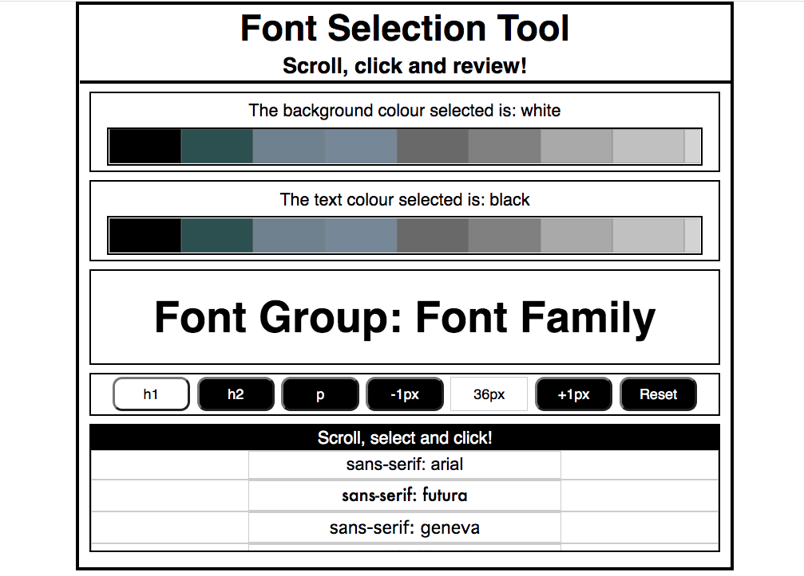
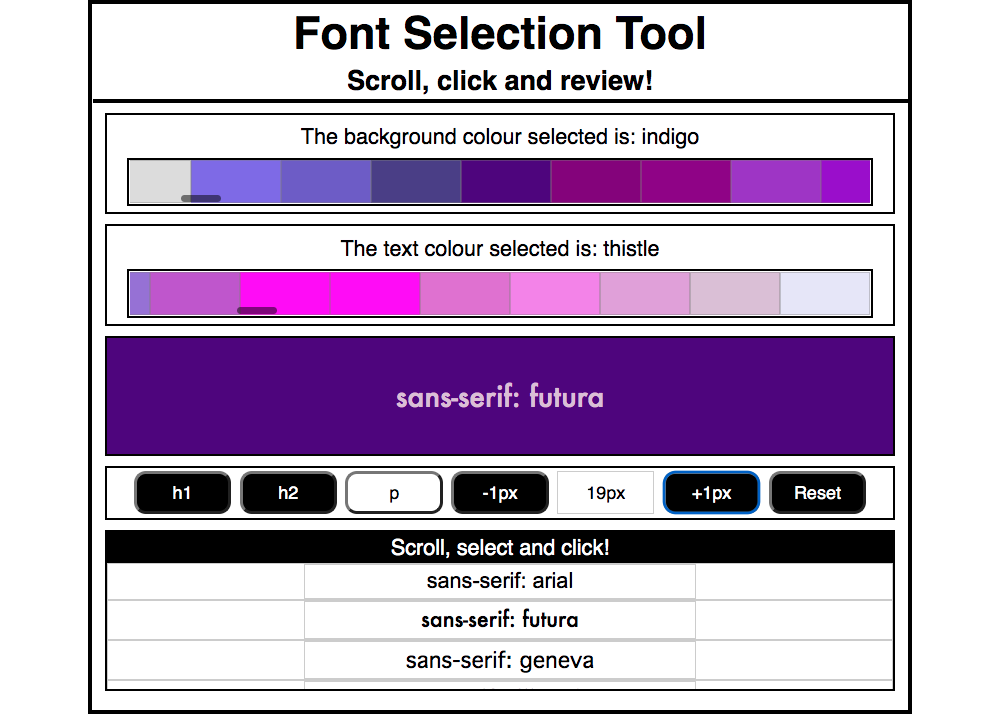
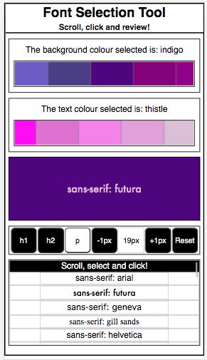

# Font Selection Tool

This tool is for helping people to select fonts when building web-applications.

## Features:
* Scrolling colour bars; used to change the text-colour and background-colour of the sample text.
* A scrolling font-family list; used to switch between various fonts.
* The ability to adjust the font-size;
* The sample text can be switched between h1, h2 and p html elements.
---
## Built with:
* React.js
* CSS
---
## App Image: Starting Image.

---
## App Image: In-use Image.

---
## App Image: Responsive Example.

